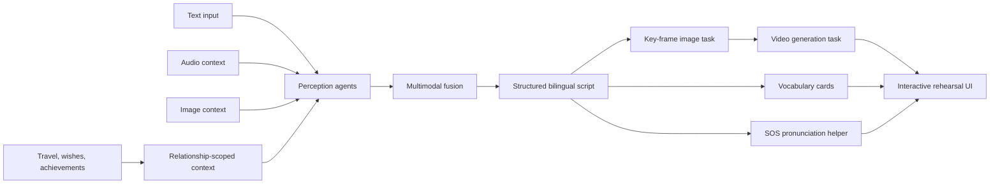

# Puppy Journey · 滑雪小狗

**An AI-native relationship and learning application built as a full-stack, multimodal product prototype**

Puppy Journey turns shared memories, travel logs, wishes, and achievements into interactive learning experiences for long-distance couples. Its central feature, the **Future Rehearsal Room**, orchestrates multiple AI stages to transform personal context into a scenario, bilingual dialogue, key-frame image, video task, vocabulary cards, and pronunciation support.

**Repository owner and engineer:** Zihan Shen

## Product and engineering highlights

- **Context-aware generation:** travel, wish, and achievement data become structured inputs to the learning pipeline instead of remaining isolated product features.
- **Multi-agent orchestration:** a LangGraph DAG separates perception, fusion, script generation, media tasks, and learning-card generation.
- **Multimodal workflow:** text, audio context, and image context feed a pipeline that can dispatch text-to-image and image-to-video providers.
- **Structured model contracts:** generated scripts use typed JSON with speakers, translations, and timestamps so the UI can render deterministic dialogue sequences.
- **Provider abstraction and fallback:** OpenAI-compatible text models and Volcengine media services are configured behind server routes, with mock paths for local development.
- **Full-stack data flow:** Next.js route handlers connect React views to Supabase PostgreSQL, Auth, and Storage.
- **Relationship-scoped isolation:** `couple_id` is the core workspace boundary for travel, wishes, achievements, and shared state.
- **Server-side credential boundary:** privileged keys remain in server-only environment variables rather than `NEXT_PUBLIC_*` configuration.



## Future Rehearsal Room

The prototype in `rehearsal_backend` models the primary agent graph as:

```text
START → perception → fusion → script → media → END
```

### Agent responsibilities

| Stage | Responsibility |
| --- | --- |
| Text perception | infer learning intent and relevant entities from user text and relationship context |
| Audio perception | estimate emotional tone and speaking cues from supplied context |
| Visual perception | identify scene and atmosphere cues from images |
| Fusion | combine the three modalities into a consistent learning brief |
| Script | produce timestamped NPC and learner dialogue as structured JSON |
| Media | dispatch image/video work and derive vocabulary cards |
| SOS side path | return low-latency pronunciation and shadowing guidance for one line |

The LLM access layer is separated from graph state and business logic, allowing model endpoints to change without rewriting node orchestration.

## Full-stack architecture

| Layer | Technology and role |
| --- | --- |
| Web application | Next.js 16 App Router, React 19, TypeScript |
| UI and motion | Tailwind CSS, shadcn, Framer Motion |
| Client state | Zustand with persistence where appropriate |
| Backend-for-frontend | Next.js Route Handlers |
| Data and identity | Supabase PostgreSQL, anonymous Auth, Storage |
| Agent graph | LangGraph prototype plus server-side pipeline routes |
| Text generation | OpenAI-compatible model endpoints |
| Media generation | Volcengine image and Seedance video tasks, with mock modes |

## Product modules

- **Couple onboarding:** create or join a room by invitation, bind two partner roles, and establish the shared workspace.
- **Relationship dashboard:** visualize reunion and distance-period countdowns alongside progress signals.
- **Travel timeline:** store structured entries and images, then derive consistent cartoon-style assets.
- **Wish wall:** manage shared goals and connect them with locations and future trips.
- **Achievement system:** coordinate personal and partner tasks, presence, focus timers, and relationship feedback.
- **Learning rehearsal:** combine generated dialogue, media, vocabulary, and SOS pronunciation assistance.

## Selected API surface

```text
POST /api/couple/create-room       POST /api/couple/join
GET  /api/couple/me                POST /api/couple/set-role
GET  /api/travel-logs              POST /api/travel-logs
POST /api/travel-logs/upload-photo GET  /api/wishes
POST /api/achievements/bootstrap   GET  /api/achievements/tasks
POST /api/pipeline/script          POST /api/pipeline/image
POST /api/pipeline/video/start     GET  /api/pipeline/jobs/[id]
GET  /api/rehearsal                POST /api/rehearsal/sos
```

## Repository structure

```text
.
├── puppy-journey/       # Next.js application, APIs, migrations, and UI
└── rehearsal_backend/   # LangGraph orchestration prototype and LLM wrapper
```

The Vercel root directory should be set to `puppy-journey`.

## Local setup

Requirements: Node.js compatible with Next.js 16 and `pnpm`.

```bash
cd puppy-journey
pnpm install
cp .env.example .env.local
pnpm dev
```

Open `http://localhost:3000`.

Minimum Supabase configuration:

```env
NEXT_PUBLIC_SUPABASE_URL=your_supabase_url
NEXT_PUBLIC_SUPABASE_ANON_KEY=your_supabase_anon_key
SUPABASE_SERVICE_ROLE_KEY=your_server_only_service_role_key
```

AI providers are optional for parts of the interface. The documented mock modes allow pipeline UI development without launching billable media jobs.

## Validation

The curated showcase passed ESLint and a complete Next.js production build on **2026-09-01**, including TypeScript checking and static-page generation.

Before deployment, run:

```bash
cd puppy-journey
pnpm lint
pnpm build
```

The repository also includes `scripts/verify-supabase-image-upload.mjs` for validating authorized storage upload behavior against a configured Supabase project.

## Security and data boundaries

- Never commit `.env.local`, service-role credentials, media-provider keys, or production customer data.
- `SUPABASE_SERVICE_ROLE_KEY` must remain server-side; do not rename it with a `NEXT_PUBLIC_` prefix.
- Every protected route should validate both user identity and couple-workspace membership.
- Generated media URLs and uploaded photos should follow explicit storage access policies.
- The included showcase assets and mock output are development examples, not a production dataset.

## Limitations

- Live media generation depends on external provider availability, quotas, and asynchronous polling.
- The Python LangGraph module is a research prototype alongside the integrated Next.js pipeline, not a separately deployed production service.
- Personalized generation can still be inconsistent; structured output validation and user review remain necessary.
- Production use would require broader automated tests, monitoring, deletion workflows, and a complete privacy review.

**Note:** This project was initially developed locally. The Git repository was created when the codebase was prepared for publication, so the early development history is unavailable. Subsequent updates are tracked in this repository.
