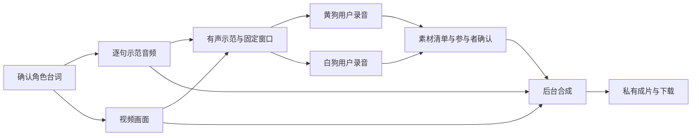

# Puppy Journey 角色配音技术设计

## 1 总体结构

| 层 | 职责 |
| --- | --- |
| 前端 | 分角预览、示范、录音、本机试听、保存/提交、确认、成片历史 |
| Next.js API | 认证、角色权限、幂等创建、限定上传、版本控制、签名访问 |
| Postgres | 会话、素材引用、确认、额度、持久任务及租约 |
| 私有媒体存储 | 示范片段、私人草稿、已提交录音、成片与字幕 |
| 媒体 worker | 原视频归档、TTS、音频验证、转码、合成和清理 |

worker 是独立 Node.js 进程，镜像固定 FFmpeg/ffprobe 版本；提供本地容器及部署说明。现有网页部署不自动等于已有媒体 worker。首版用 Postgres 原子领取任务，不先引入 Redis。

请求完成后不运行无管理的后台 Promise；GET 查询不负责执行音频生成或合成。浏览器关闭后，已上传素材的后台任务可以继续。

## 2 AI 分角与示范方案

### 2.1 剧本契约

在保存剧本时添加独立的版本化配音方案，不破坏旧 ScriptLine 读取：

| 字段 | 含义 |
| --- | --- |
| planVersion、scriptDigest | 固定本次剧本与分角版本 |
| locale | 首发 es-ES；与服务端获批语言列表匹配 |
| lineId、ordinal | 稳定句子 ID 和顺序 |
| speakerKey | yellow_dog / white_dog / npc:稳定ID |
| dubbable | 是否允许用户录制；NPC 为 false |
| text、translation | 保存的原台词与中文辅助 |
| voicePreset | 服务端获批的示范音色逻辑 ID |

新剧本在原有生成调用内输出明确角色与短句安排，不额外堆一个大模型调度层。提示词要求两只小狗各有可练习的完整短句，控制对白长度并保持对话自然；角色、至少一句/人、长度和 ID 唯一性由服务器检查。

失败可在明确次数限制内修正结构，但不能把生成失败当作可用方案。对旧剧本先读取已有 character；明确的白狗/黄狗可规则映射，缺失或矛盾时要求用户确认，不按 npc/player、性别或昵称猜。

AI 可提出分配建议，不能生成 user ID、couple ID 或决定谁可以访问录音。用户调整分工只允许在方案冻结前；开始录音后创建新方案。旧台词不能被新版本同名 lineId 意外复用。

### 2.2 有声示范的制作

1. 新建排练先生成剧本、确认角色分工并冻结方案，再生成关键帧和视频；历史排练只映射已有明确角色，改角色或台词必须新建排练。
2. 验证原排练归属和源视频可用，归档到私有存储，再按冻结台词逐句 TTS；每句保存音频和实测时长。
3. 计算可录制窗口及总时长；需要短暂末帧停留时让创建者确认。
4. 去除视频供应商的整条混合音轨，用示范片段制作有声版与字幕。
5. 验证成片后发布示范，允许进入录音。

这不是从混合原声中分离黄狗/白狗。首版不保留原背景音乐；未来只有拿到独立、获授权的背景轨才能加入混音。

新建排练在分角预览阶段控制句长；历史视频的角色分工与画面明显不一致时，需要新建排练。不能只换声音就承诺修复画面角色。付费 TTS 只在源视频归档成功之后调用，避免已过期视频继续消耗语音额度。

### 2.3 TTS 候选与限制

候选为豆包单向 HTTP 语音合成接口。官方文档支持分块返回音频和指定语言，其中 es-es 仅部分音色支持；需在实际账户内验证，不能假定现有视频 API key 具有语音权限。见[官方语音接口](https://docs.volcengine.com/docs/DoubaoVoice/unidirectional-streaming-text-to-speech-http?lang=zh)。

adapter 输入为台词、获批音色、locale、语速档、请求 ID 与取消信号；输出音频及供应商请求元数据。具体音色 ID、模型和鉴权参数在接入时核对，不在方案中编造。

TTS 只接收必要台词，不接收私人录音或完整历史。缓存键包含空间、源排练、剧本版本、句子文本摘要、locale、音色、模型与参数，不能跨情侣空间公用私人内容。测试使用明确标注的合成音频，不用提示音证明西语发音合格。

## 3 逐句窗口和声音替换

### 3.1 示范窗口

模型的 startTime/endTime 不作为配音依据。建议初始算法：

- 统一解码格式为 48 kHz PCM，测量每句示范音频时长 d。
- 小狗句窗口长度 = max(2 秒, d × 1.25 + 0.25 秒)；每句上限 10 秒。
- NPC 窗口 = d + 0.25 秒；相邻窗口另留 0.15 秒。
- 片首、片尾各留 0.15 秒。示范音频放在窗口开头，剩余部分补静音。
- 字幕跟随整句窗口。上面数字是待试听调整的初值，算法版本进入指纹。

窗口序列定稿后，写入不可变 timeline。用户看见的可录制时间以服务器时间线为准。

现有画面目标约 8 秒。总窗口时长小于画面时长则保留尾部画面；超过时，最多允许 min(4 秒, 原画面时长 × 50%) 的末帧停留，并且总长不超过 30 秒。超过边界不能开放录音，需先缩短剧本或重新制作方案。末帧停留使用 FFmpeg tpad 的 clone 能力，见[官方滤镜说明](https://ffmpeg.org/ffmpeg-filters.html#tpad)。

### 3.2 真人录音

录音用目标台词窗口指导节奏，超出窗口时提示超时，但不立即截音。区分“台词窗口”和“单句 10 秒录制安全上限”：用户主动停止的完整片段即使超过窗口，也可保存为私人 needs_trim 草稿；触发安全上限自动停止的片段标为 incomplete，只能重录，不能提交或合成。服务器实际解码检查时长，不能相信客户端计时。

用户可选择裁去首尾空白，但必须试听裁剪后的版本并再次确认；不能自动去掉词尾或中间停顿。裁剪产生新的不可变素材，只有通过台词窗口验证后才可提交；仍超窗则保留 needs_trim 或重录。原录音可保留为本人草稿。静音检测只给质量提示，不当作语音内容或发音正确性判定。

较短的已确认录音末尾补静音，较长则拒绝进入合成。不做自动人声加速。只延长全片末帧不能修复中间句超窗，所以真人配音不改变已经固定的窗口。

### 3.3 成片清单

每句恰好选择一个来源：获授权的真人 take 或对应 AI 示范。NPC 固定使用示范。单人模式中另一角色全部使用示范；双人模式必须两位原参与者均提交选择，且各至少有一句真人声音。

没有录音的本人句子必须显式选择“保留 AI”；服务器不能静默补齐。清单固定每个音频资产及哈希、时间线、角色分配版本、双方提交版本、编码参数和素材来源标签。

成片用本地文件合成独立 MP4：H.264 + AAC、yuv420p、渐进播放，原始视频音轨不参与混合。发布前探测实际音视频轨与时长，并验证所有台词完整覆盖。字幕按固定窗口显示保存的台词，不声称是对真人声音的转写或逐词对齐。

## 4 浏览器录音与上传

### 4.1 录制状态

idle → requesting_permission → countdown → recording → local_preview → uploading → validating → saved_private / needs_trim

安全上限硬停的 incomplete 片段只能本机试听后重录，不进入上传路径；needs_trim 可以保存但不可分享或合成。

异常与中断单独显示，不能用 saved 代表请求已经发出。用户点击后才调用 getUserMedia，只申请音频；处理拒绝、无设备、设备占用和权限长期未响应。它要求安全上下文和用户授权，见[MDN 麦克风接口说明](https://developer.mozilla.org/en-US/docs/Web/API/MediaDevices/getUserMedia)。

录音前检测 MediaRecorder.isTypeSupported，按能力选 WebM/Opus 或 MP4/AAC 等允许格式，记录实际 recorder.mimeType，服务器最终探测；不能只按浏览器名称硬编码。格式探测成功也不保证实际录制成功，见[MDN 格式检测说明](https://developer.mozilla.org/en-US/docs/Web/API/MediaRecorder/isTypeSupported_static)。

倒计时用视觉提示，录制时关闭示范声音，不将麦克风回放到扬声器。收到最终音频块及 stop 事件后才能保存。不能用 chunk 数量推算时长；页面隐藏、锁屏、来电和设备断开应终止本句并要求确认完整性。停止、退出、关闭面板时释放媒体 tracks 和 Blob URL。

本机试听不上传。点击“保存这一句”才传到服务器，首次保存前解释私人草稿用途；刷新未上传草稿可能丢失，界面必须提醒。

### 4.2 上传边界

首版每句最多 3 MiB、10 秒，完整请求体最多 4 MiB，走认证后的受限 multipart API，避免客户端拿到宽泛桶权限。入口首先验证登录、原参与者、当前角色和台词窗口，流式限制请求体大小，不能等整包进内存再检查。部署若有更低请求体限制，以部署限制为上限并完成真机测试；不能到上线才发现移动端录音传不上去。

服务器生成随机临时对象路径，校验实际文件格式、解码时长、音轨数量、文件头和资源消耗，拒绝视频、损坏文件、超过安全上限或明显无声片段。处于安全上限内但超出台词窗口的完整音频只能标记 needs_trim，不能标成可提交；提交与合成接口再次校验。上传只能创建不可变新 take，不能覆盖已提交素材。超限、中断、验证失败都不将 take 标成可用。

worker 负责受限环境内探测与转码；浏览器录音 MIME 和 duration 只作提示。调用 FFmpeg 使用参数数组，不用 shell 拼接；只允许本地媒体协议与受控路径，不允许音频文件引用外部 URL。

保存/验证接口以 upload ID 幂等；重复网络重试不能产生重复片段或重复扣额度。未完成的临时上传 24 小时内清理。

## 5 数据与权限

### 5.1 概念模型

以下表名是设计草案，批准后才创建迁移。

| 实体 | 关键内容 |
| --- | --- |
| rehearsal_dubbing_guides | 原排练与画面版本、分角快照、locale、时间线、逐句示范引用、算法版本及状态 |
| rehearsal_dubbing_sessions | guide ID、couple ID、黄/白参与者 user ID 快照、会话版本、状态 |
| rehearsal_dubbing_takes | session/line/owner/role、媒体引用、校验状态、private/shared/revoked、版本及时间 |
| rehearsal_dubbing_submissions | 每个参与者当前提交的逐句 take/AI 选择、提交版本、分享同意记录 |
| rehearsal_dubbing_renders | 不可变清单、digest、所需参与者、各人确认、任务状态与成片引用 |
| rehearsal_dubbing_jobs | guide/validate_take/render/purge 类型、阶段、进度、租约、重试、安全错误 |
| rehearsal_dubbing_assets | 私有路径、归属、用途、哈希、时长、大小、编码、引用关系与撤销标志 |
| 请求与额度记录 | 幂等键、请求摘要、对应资源；TTS 字符、上传容量、合成次数的原子预留与结算 |

同一 take 被多个成片引用时保留明确关联，供删除与撤销时定位。资源 ID、角色、对象路径和归属都由服务器确认，不从请求体直接采信。

### 5.2 授权矩阵

除本人录音管理与撤回/删除外，每项 API、资源签名和 worker 发布均检查当前账号仍是会话原参与者，且情侣空间与角色绑定仍符合会话快照。任何被使用的真人片段，还须复核声音所有者的当前资格与同意。下面各行均在这个共同前提下执行。

| 操作 | 权限 |
| --- | --- |
| 查看示范、会话进度 | 会话原参与者，且仍满足原情侣空间成员及角色绑定 |
| 创建/修改自己的录音 | 当前角色与会话角色一致，line 允许该角色配音 |
| 试听私人草稿 | 仅录制者 |
| 试听已提交录音 | 原参与者且分享同意未撤回 |
| 提交一个角色的选择 | 仅该角色本人 |
| 确认使用真人声音 | 仅声音本人，绑定完整 render digest |
| 合成/下载 | 全部必要同意有效，当前请求者仍是原参与者 |
| 删除录音 | 仅录制者，展示派生成片影响 |
| 取消后台合成 | 发起者可取消；任何声音被撤回也必须阻止发布 |

数据库新增 RLS 是防线之一；现有 service-role API 必须继续显式鉴权。对象的权限不能简化为“couple_id 相同即可”，私人草稿和原参与者约束都要检查。跨空间 ID 返回统一 404。

成员位更换、两人互换角色或关系解除时，应在成员变更的同一数据库事务内撤销关联会话的继续使用资格及待执行确认；读、签名和发布入口仍实时复核，不能只靠异步清理。旧会话不能自动继续录制或把声音暴露给新成员，需要建立新会话，不搬运旧真人录音。无 couple 的旧排练暂不开放配音，先完成明确的归属迁移。

本人录音管理是限定例外：只要求有效登录与 owner_id 匹配，不要求仍在原情侣空间。账号“我的录音”仅返回本人 take ID、时间、状态等管理元数据及影响数量，允许撤回/删除，不返回旧空间台词、对方数据或播放 URL。该路径不能复用会拒绝退出者的 couple gate。

### 5.3 双方确认

保存草稿、分享给伴侣、授权合成是三种不同状态。

双方的最终确认记录绑定同一个完整 render digest，包含所有 take ID/哈希与双方提交版本。若任一句素材、分工或时间线变动，创建新 render 计划，旧确认不用于新计划。最后一人确认和入队在事务内完成，避免“双确认后没有任务”或重复入队。

单人版只需要实际被使用声音的本人确认，不强迫伴侣上线；另一角色必须明确使用 AI。已有成片不因新录音自动改变，但主动撤销素材会使使用该素材的成片不可再发布/签名。

## 6 API 草案

以下均需现有 bearer 认证。除本人录音管理/删除例外外，角色来自 coupleWorkspaceContext 并与会话快照核对，不接受客户端自由选择写权限。

| 接口 | 用途 |
| --- | --- |
| POST /api/pipeline/jobs/:id/dubbing-guides | 固定/确认角色方案，制作或复用有声示范 |
| POST /api/dubbing/guides/:id/confirm-duration | 确认末帧停留；绑定 timeline digest |
| POST /api/dubbing/guides/:id/retry | 仅恢复可判定安全的示范失败，复用已有 TTS |
| POST /api/dubbing/guides/:id/sessions | 创建或恢复当前原参与者的录音会话 |
| GET /api/dubbing/sessions/:id | 返回自己草稿及获准共享内容，对方私人片段只返回进度 |
| POST /api/dubbing/sessions/:id/takes | 受限 multipart 上传自己的单句录音 |
| POST /api/dubbing/takes/:id/trim | 提交试听后的首尾裁剪范围，产生新素材 |
| POST /api/dubbing/sessions/:id/submissions | 提交本人逐句选择及分享同意，校验 expectedRevision |
| POST /api/dubbing/sessions/:id/renders | 生成单人或双人不可变成片清单 |
| POST /api/dubbing/renders/:id/consents | 本人确认指定 digest；最后确认完成后入队 |
| GET /api/dubbing/jobs/:id | 只读持久进度，不驱动供应商执行 |
| POST /api/dubbing/renders/:id/retry | 复核同意与权限后恢复合成，复用录音 |
| POST /api/dubbing/renders/:id/cancel | 取消后续处理，迟到结果不得发布 |
| POST /api/dubbing/assets/:id/access | 按私人/共享/成片权限申请限时播放或下载 |
| GET /api/dubbing/my-recordings | 登录者本人的管理元数据；退出空间后仍可用，不返回播放权限 |
| DELETE /api/dubbing/takes/:id | 撤销声音，关联下线受影响结果，后台清理 |

创建类请求使用 Idempotency-Key；同键同内容返回原资源，不同内容返回 409。相同清单/编码版本合成成功后复用成片；不因重复按钮额外编码或调用视频/TTS。提交版本冲突返回 409，提示刷新，不能覆盖伴侣新状态。

进度采用只读轮询即可：活动页面约每 2 秒查询，长任务退避，后台减少请求。UI 区分待确认、排队、验证、合成、失败；不伪造百分比。历史记录显示示范与配音子版本，只有用户打开素材时才签名。

## 7 后台执行与恢复

任务队列用 Postgres 行锁与 SKIP LOCKED 原子领取，写入随机租约 token。建议租约 90 秒、每 20 秒续约；写进度、发布结果、错误恢复都需匹配任务状态、token 和未过期租约。任务状态按类型保存，不能将“正在上传”和“已授权合成”合并成一个完成标记。

worker 执行步骤可重入：

1. 复核任务、会话原参与者、同意和取消状态。
2. 读取已验证的素材，复用完成步骤。
3. 在 attempt 独立路径生成临时文件。
4. 探测输出音轨、时长、大小与编码，上传不可变对象。
5. 再次检查租约、素材未撤回及同意仍有效，事务发布结果。
6. 不可发布的输出由清理任务回收。

旧 worker 失去租约后不得覆盖结果或删掉新 attempt。取消和删除先在数据库阻止新领取/发布/签名，再清理物理文件；所有步骤需可重试。

示范需要时长确认时进入 awaiting_duration_confirmation，保存 timeline digest 并释放 worker 租约。用户确认相同摘要后事务入队继续合成，不让进程持租约等待点击。等待超过 7 天则过期；已完成且被其他有效结果引用的资产不随它清理。

TTS 的网络模糊失败单独处理：请求可能被供应商接受但未收到结果时，记录 unknown，停止自动重发。只有供应商提供可核实的查询或幂等保证才自动恢复，否则提示可能重复计费并要求确认。应用幂等不能保证第三方计费严格一次。

重录仅新增该句录音；重试成片仅执行合成，不重新调用剧本、画面和 TTS。用户音频不发给 TTS 做“修复”。

## 8 媒体安全与保留

### 私有存储

使用新私有桶，路径由服务器生成；禁止客户端列举和任意写入。原视频快照、示范音频、私人草稿与成片按用途分开管理，签名接口每次检查对应权限。

私有桶支持授权下载或限时签名，见[Supabase 桶权限](https://supabase.com/docs/guides/storage/buckets/fundamentals)。建议播放链接 TTL 10 分钟，缓存策略与有效期一并验证；签名 URL 不绑定正在登录的用户，也不能通过轮换 Auth key 即时撤回，见[签名下载说明](https://supabase.com/docs/guides/storage/serving/downloads)。不将签名 URL 持久化或写入日志。

删除/退出后立即停止签发新链接，但不承诺旧链接、CDN 缓存或已下载文件瞬间消失。

### 源视频导入

供应商返回的外链也必须检查。仅下载已保存且获准来源的 HTTPS URL，使用供应商域名允许列表，校验公网 DNS 地址并绑定实际连接，逐跳复查重定向；拒绝私网、回环和元数据地址。限制字节、下载时长和解码资源。

FFmpeg 不接触网络 URL，不解析任意外部播放列表。用受限容器处理媒体，禁止 shell 字符串拼接，设置 CPU、内存、超时、临时磁盘和分辨率上限。

### 保留与撤回

- 未完成上传/临时 attempt：24 小时内清理。
- 私人未提交草稿：最近保存后 7 天，界面展示期限；发布素材不套用草稿清理规则。
- 已提交录音及成功成片：保留至本人撤回或删除，受空间存储额度限制。
- 无引用的失败示范/合成中间件：7 天后回收，不误删仍被成功版本引用的片段。

本人删除 take 时事务标记撤销、取消待合成、下线引用成片，再异步清理。其他参与者不能通过改角色取得删除权。数据库须保存引用关系与清理结果；worker 发布前再次检查，防止删除后的声音被迟到任务复活。
